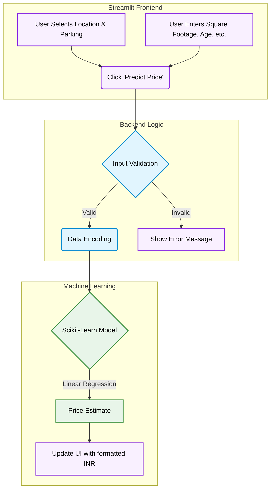

<div align="center">

# House Price Predictor

**A responsive web application that predicts house prices using Linear Regression, built with Streamlit and scikit-learn**

[](https://www.python.org/)
[](https://streamlit.io/)
[](https://scikit-learn.org/)

</div>

---

## Overview

A simple House Price Prediction web application built using **Streamlit** and **Linear Regression** (scikit-learn). Users pick a location and parking option from dropdowns, enter house details (area, bedrooms, bathrooms, and age), and get an instant price estimate powered by localized INR pricing algorithms and age-depreciation logic.

---

### Application Flow



## Features

| | |
|---|---|
| **Responsive Web App** | Built entirely with Streamlit for a fast, interactive experience |
| **Linear Regression Model** | Trained on a sample housing dataset with pandas + scikit-learn |
| **Realistic INR Pricing** | Predicts prices mapped to the Indian number system formatting |
| **Age Depreciation** | Automatically accounts for property age in pricing logic |

---

## Tech Stack

**Language** - Python 3.x
**Web Framework** - Streamlit
**Machine Learning** - pandas · scikit-learn (Linear Regression)

---

## Setup and Installation

### 1. Clone the repository

```bash
git clone https://github.com/Shashank17singh/NIELIT-Project.git
cd NIELIT-Project
```

### 2. Install dependencies

```bash
pip install -r requirements.txt
```

### 3. Run the app

```bash
streamlit run main.py
```

Fill in the house details, select a location and parking option, and click predict to see the estimated price.

---
