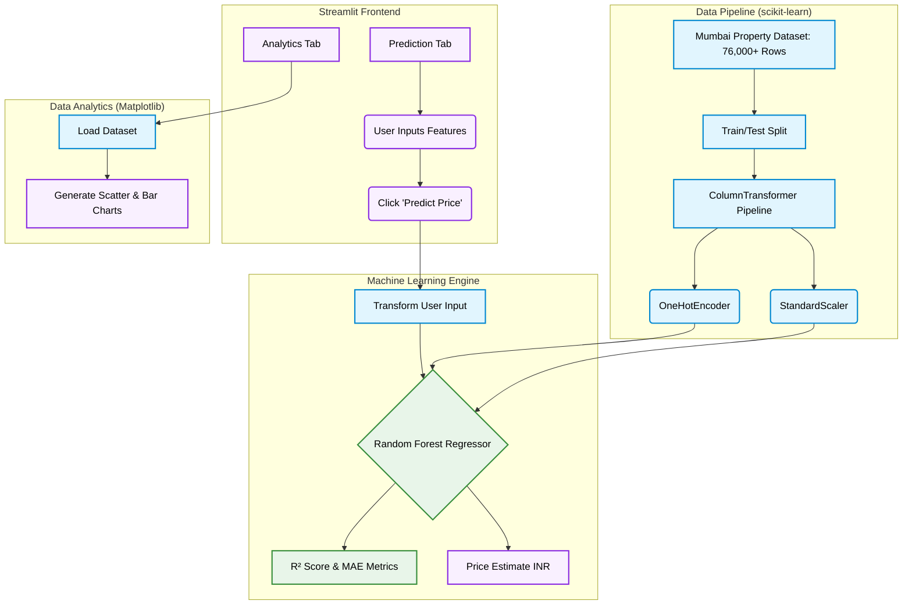

<div align="center">

# House Price Predictor (Random Forest)

**An end-to-end Machine Learning pipeline that predicts Mumbai house prices using a Random Forest Regressor, built with Streamlit and scikit-learn.**

[](https://www.python.org/)
[](https://streamlit.io/)
[](https://scikit-learn.org/)
[](https://pandas.pydata.org/)
[](https://matplotlib.org/)

</div>

---

## Overview

Developed as part of NIELIT Data Science curriculum, this is a robust House Price Prediction web application built using **Streamlit** and a **Random Forest Regressor** pipeline (scikit-learn). Trained on a real-world dataset of **76,000+ Mumbai property listings**, the application processes dynamic user inputs through a `ColumnTransformer` (scaling numerical features and encoding categoricals) to provide high-accuracy, localized INR price estimates.

It also features a dedicated **Data Analytics** tab providing data visualizations (scatter plots and bar charts) powered by Matplotlib to explore pricing trends across the Mumbai real estate landscape.

---

### Application Architecture



## Features

| | |
|---|---|
| **Random Forest Regressor** | High-accuracy modeling pipeline trained on 76k+ records |
| **Data Processing Pipeline** | Integrated `ColumnTransformer` for robust scaling & encoding |
| **Data Analytics Dashboard** | Visualizes Mumbai real-estate trends using Matplotlib |
| **Responsive UI** | Built entirely with Streamlit for a fast, interactive experience |

---

## Tech Stack

- **Language** - Python 3.x
- **Web Framework** - Streamlit
- **Machine Learning** - scikit-learn (Random Forest Pipeline, ColumnTransformer)
- **Data & Analytics** - pandas, NumPy, Matplotlib

---

## Setup and Installation

### 1. Clone the repository

```bash
git clone https://github.com/Shashank17singh/NIELIT-Project.git
cd NIELIT-Project
```

### 2. Install dependencies

```bash
pip install -r requirements.txt
```

### 3. Run the app

```bash
streamlit run main.py
```

Switch between the **Prediction** and **Analytics** tabs from the sidebar to explore the application!

---
