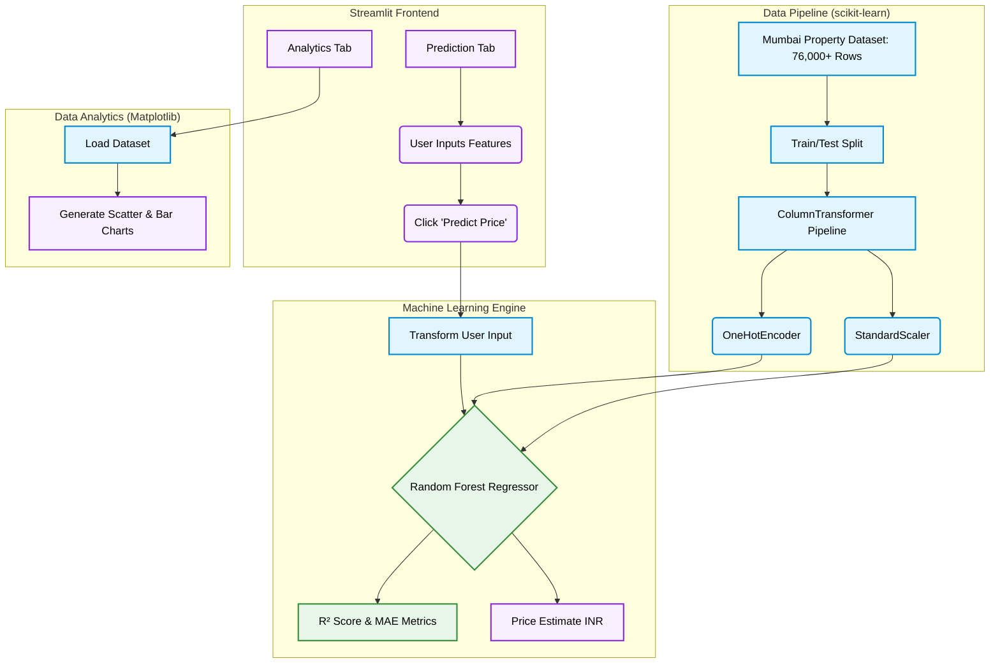

<div align="center">

# House Price Predictor (Random Forest)

**An end-to-end Machine Learning pipeline that predicts Mumbai house prices using a Random Forest Regressor, built with Streamlit and scikit-learn.**

[](https://www.python.org/)
[](https://streamlit.io/)
[](https://scikit-learn.org/)
[](https://pandas.pydata.org/)
[](https://matplotlib.org/)

</div>

---

## Overview

A machine learning pipeline for predicting property prices in Mumbai. It includes a Random Forest model, a Streamlit web app, a Tkinter desktop GUI, and an SQLite database for persistent records.

It integrates a **SQLite** database to log user prediction queries, processes dynamic user inputs through a `ColumnTransformer`, and features a dedicated **Data Analytics** tab providing insights powered by Matplotlib and Seaborn.

---

### Application Architecture


```mermaid
graph TD
    subgraph "Streamlit Frontend"
    A[Prediction Tab]
    B[Analytics Tab]
    A --> C(User Inputs Features)
    C --> D(Click 'Predict Price')
    end

    subgraph "Data Pipeline (scikit-learn)"
    E[Mumbai Property Dataset: 76,000+ Rows]
    E --> F[Train/Test Split]
    F --> G[ColumnTransformer Pipeline]
    G --> H(StandardScaler)
    G --> I(OneHotEncoder)
    end

    subgraph "Machine Learning Engine"
    H & I --> J{Random Forest Regressor}
    J --> K[R² Score & MAE Metrics]
    D --> L[Transform User Input]
    L --> J
    J --> M[Price Estimate INR]
    end

    subgraph "Data Analytics (Matplotlib)"
    B --> N[Load Dataset]
    N --> O[Generate Scatter & Bar Charts]
    end

    classDef io fill:#f9f0ff,stroke:#8a2be2,stroke-width:2px,color:#000;
    classDef core fill:#e1f5fe,stroke:#0288d1,stroke-width:2px,color:#000;
    classDef logic fill:#e8f5e9,stroke:#388e3c,stroke-width:2px,color:#000;

    class A,B,C,D,M,O io;
    class E,F,G,H,I,L,N core;
    class J,K logic;
```

## Features

|                              |                                                                 |
| ---------------------------- | --------------------------------------------------------------- |
| **Interactive UIs**          | Glassmorphism Streamlit web app & local Tkinter desktop GUI     |
| **Dual ML Models**           | Compares Random Forest against a Linear Regression baseline     |
| **Data Persistence**         | Uses SQLite to log user prediction history locally              |
| **Data Processing Pipeline** | Integrated `ColumnTransformer` for robust scaling & encoding    |
| **Data Analytics Dashboard** | Visualizes Mumbai real-estate trends using Matplotlib & Seaborn |

---

## Tech Stack

- **Language** - Python 3.x
- **Web Framework** - Streamlit
- **Desktop GUI** - Tkinter (`tkinter_app.py`)
- **Machine Learning** - scikit-learn (Random Forest, Linear Regression, ColumnTransformer)
- **Data & Analytics** - pandas, NumPy, Matplotlib, Seaborn
- **Database** - SQLite (`predictions.db`)

---

## Setup and Installation

### 1. Clone the repository

```bash
git clone https://github.com/Shashank17singh/NIELIT-Project.git
cd NIELIT-Project
```

### 2. Install dependencies

```bash
pip install -r requirements.txt
```

### 3. Run the applications

Start the Streamlit web server:

```bash
streamlit run main.py
```

Or, run the standalone Tkinter desktop application:

```bash
python tkinter_app.py
```

Switch between the **Prediction**, **Analytics**, and **Prediction History** tabs from the sidebar to explore the web application!

---

---

## Deployment

- **Dashboard URL:** https://nielit-project.streamlit.app/

---


